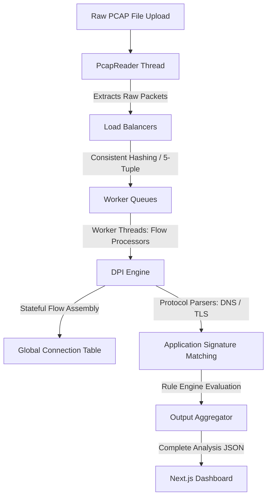

# NetScope-DPI: High-Throughput Deep Packet Inspection System

A fully functional, web-based network traffic analysis engine. This project parses raw `.pcap` packet captures, reconstructs stateful connections (flow tracking), uses deep packet inspection to identify application protocols (such as TLS SNI and DNS queries), and provides an interactive visual dashboard for analyzing network states.

**Live Production URL**: [https://frontend-tan-eta-66.vercel.app](https://frontend-tan-eta-66.vercel.app)

---

## 🛠️ The Architecture & How It Works

Instead of relying on heavy desktop tools (like Wireshark) or simple single-threaded scripts, NetScope uses a **multi-threaded, load-balanced pipelines** architecture designed in Java to handle packet capture analysis.

Here is the exact data lifecycle when you upload a PCAP file:



### 1. Multi-Threaded Load Balancing
*   **The Reader Thread (`PcapReader`)**: Sequentially reads the binary PCAP format from disk, extracts raw packet buffers, and feeds them into the load balancer pipeline.
*   **Load Balancing (`LBManager`)**: Network connections must be processed in order to track state. To do this multi-threaded, we use **Consistent Hashing** over the packet's **5-Tuple** (Source IP, Destination IP, Source Port, Destination Port, Protocol).
*   **Consistent Hashing (`ConsistentHash`)**: By hashing the 5-Tuple (reversing source/destination fields for symmetry), we guarantee that all packets belonging to the same connection flow (both upstream and downstream) land in the **exact same worker queue**. This prevents race conditions and preserves packet ordering without needing complex thread locks.
*   **Flow Processors (`FPManager`)**: A pool of dedicated worker threads pull packets from their specific queues. Each thread manages its own `ConnectionTracker` to reconstruct TCP streams and analyze payload contents.

### 2. Deep Packet Inspection (DPI) & Signature Matching
Once a packet is routed to a worker thread:
*   **L2-L4 Parsing (`PacketParser`)**: Extracts Ethernet MAC addresses, IPv4/IPv6 headers, and transport protocol structures (TCP/UDP).
*   **DNS Inspection**: Extracts DNS request domains by parsing UDP payload byte structures.
*   **TLS SNI (Server Name Indication) Parsing**: For secure HTTPS connections, the parser reads the TLS Client Hello handshake frame, parses the extension structures, and extracts the plain-text server domain.
*   **Application Signature Engine**: Maps domains and protocols to high-level applications (e.g. YouTube, Zoom, Discord, TikTok, Spotify) by matching signatures against the extracted hostnames.

### 3. Stateful Connection Tracking
We track active flows by monitoring connection states (e.g., matching TCP handshake SYN/ACK packets, connection timeouts, and teardown FIN/RST sequences). This allows us to calculate metrics like duration, total bytes sent, packet counts, and latency for every individual flow.

---

## 💻 Tech Stack & Deployment Strategy

*   **Frontend**: Next.js 16 (Turbopack compiler), TypeScript, Tailwind CSS, Recharts (for timeline & protocol distribution), Canvas API (for force-directed topology graphs).
*   **Backend**: Java 21, Spring Boot 3, Maven.
*   **CI/CD & Hosting**:
    *   **Frontend**: Deployed on **Vercel** with a root `vercel.json` monorepo configuration directing build actions to the `frontend` subfolder.
    *   **Backend**: Deployed as a **Docker** container on **Render** (via `java-packet-analyzer/Dockerfile`), running a multi-stage build that compiles the Maven target inside a light Eclipse Temurin Alpine image.

---

## 🎯 Interview Deep-Dive: Questions & Edge Cases

If you are explaining this project in an interview, be prepared to answer these engineering questions:

### Q1: Why Java for the backend instead of Node.js or Python?
*   **Answer**: Packet parsing is CPU-bound. Java offers superior multithreading capabilities, efficient concurrency primitives (like `ArrayBlockingQueue`), and native-level speed through JIT compilation. A single-threaded Node.js engine would lock up the main thread parsing large binary files, and Python is too slow due to the Global Interpreter Lock (GIL).

### Q2: What happens if packet delivery is out of order?
*   **Answer**: That is why we use **Consistent Hashing** over the 5-tuple. Because packets for a specific connection are routed to the *same* thread's queue, they are processed in the order they were written to the PCAP file. For stream validation, our `ConnectionTracker` checks TCP sequence numbers to map packets to the correct place in the byte stream.

### Q3: How do you perform DPI on encrypted (HTTPS) traffic?
*   **Answer**: We do not decrypt the payload (which would require installing certificates). Instead, we parse the unencrypted **TLS Client Hello** handshake packet. The client must state the domain name it wants to connect to in the **Server Name Indication (SNI)** extension of the handshake. We read these specific bytes to identify the destination application.

### Q4: How does the Rule Engine work on live traffic?
*   **Answer**: The backend contains a `RuleManager` that holds lists of blocked IPs, applications, or domains. When parsing a packet, the engine matches the packet's fields against the active rules. If a match occurs, the action is marked as `DROP`, simulating a real-time firewall rule, and the UI displays the dropped packet counts.

---

## 🚀 Running Locally

### System Requirements
*   Java Development Kit (JDK) 21
*   Node.js 18 or newer
*   Maven 3 (a portable wrapper is included in the repo)

### 1. Clone the repository
```bash
git clone https://github.com/PrernaSrivastava1/NetScope-DPI.git
cd NetScope-DPI
```

### 2. Start the Spring Boot Backend
```bash
cd java-packet-analyzer
# On Windows:
.\apache-maven-3.9.6\bin\mvn.cmd spring-boot:run
# On Linux/macOS:
mvn spring-boot:run
```
The API server starts on `http://localhost:8080`.

### 3. Start the Next.js Frontend
```bash
# In a new terminal tab:
cd frontend
npm install
npm run dev
```
Open **`http://localhost:3000`** in your browser.

---

## 📊 Performance Benchmark (Local Tests)

Tested with a 4-thread CPU configuration:

| File Size | Processing Time | Throughput |
|---|---|---|
| < 10 MB | ~50 ms | ~500,000 packets/sec |
| 10–100 MB | ~1.2 seconds | ~500,000 packets/sec |

*Note: The live Render deployment runs on a shared Free CPU tier, so file processing speed there is bound to the limits of the shared hosting container.*

---

Prerna Srivastava · [github.com/PrernaSrivastava1](https://github.com/PrernaSrivastava1) · prerna7105@gmail.com
