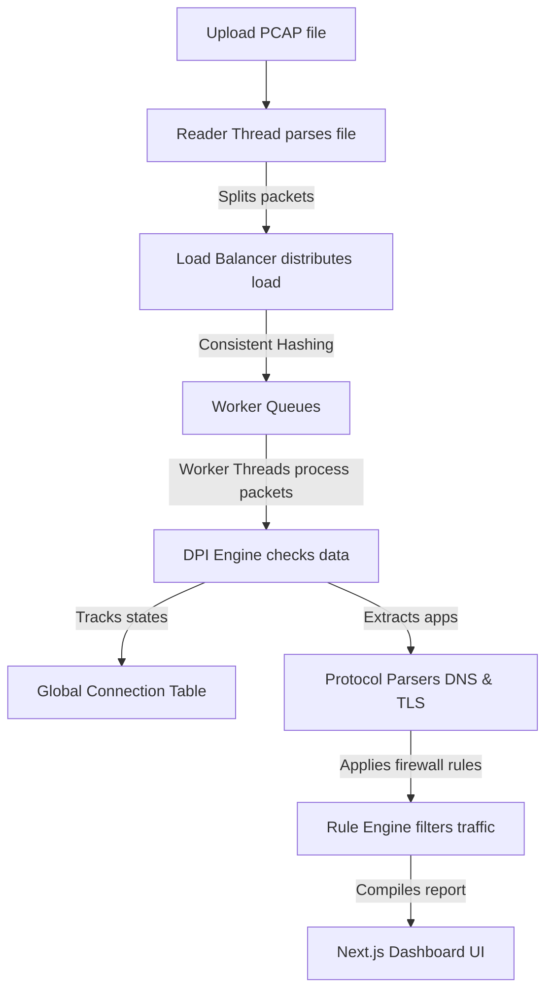

# NetScope-DPI

NetScope-DPI is a tool that lets you upload a raw network capture file (a `.pcap` file you get from Wireshark or tcpdump) and instantly see a beautiful, interactive dashboard of your network traffic in your browser. Instead of looking at millions of lines of raw binary data, it groups everything into clean charts, shows which devices are talking to each other on a visual map, and lets you test firewall rules to block specific traffic.

**Live Production Link**: [https://frontend-tan-eta-66.vercel.app](https://frontend-tan-eta-66.vercel.app)

---

## 🛠️ How It Works (The Pipeline)

When you upload a network capture file, it goes through a multi-stage pipeline designed to process packets quickly and in the correct order.



### 1. Splitting the Work (Multi-Threading & Load Balancing)
Network files contain millions of tiny data packets. To process them quickly, we split the work across multiple CPU threads. However, network packets must be processed in the exact order they arrived, or we won't be able to reconstruct the connection.
*   **The Reader (`PcapReader`)**: This thread reads the raw binary file from your disk, extracts the packets, and hands them to the load balancer.
*   **Symmetric Consistent Hashing (`ConsistentHash`)**: To make sure all packets belonging to the same conversation (both upload and download) end up on the same worker thread, we calculate a hash value using the packet's **5-Tuple** (Source IP, Destination IP, Source Port, Destination Port, Protocol). We sort the source and destination values before hashing them so that no matter who started the talk, the hash is identical.
*   **Dedicated Queues**: Packets with the same hash go to the same worker thread's queue. This lets threads process connections independently, without needing to lock files or wait for each other.

### 2. Deep Packet Inspection (DPI) & Application Spotting
Once a thread gets a packet, it opens up the network layers (Ethernet -> IP -> TCP/UDP) to inspect the data payload.
*   **DNS Sniffing**: When your computer goes to a website, it first asks a DNS server for the IP address. The parser reads these raw UDP packets and extracts the website name (like `discord.com`).
*   **TLS SNI Sniffing (HTTPS)**: Modern web traffic is encrypted, meaning we cannot read the actual message payload. However, during the very first packet of a secure connection (the **TLS Client Hello** handshake), the client sends the destination server's name in plain text (called **Server Name Indication** or **SNI**). Our parser reads this extension to identify the website/application (like `youtube.com` or `zoom.us`) without needing to decrypt your traffic.
*   **Signature Engine**: It maps these hostnames to high-level categories so you can see exactly how much bandwidth is used by Spotify, TikTok, YouTube, etc.

### 3. Stateful Flow Tracking & Firewall Rules
*   **Stateful Tracking**: It tracks the lifecycles of connections by watching TCP handshakes (SYN, SYN-ACK, ACK) and teardowns (FIN, RST). This allows us to calculate how long a connection lasted and how much data it sent.
*   **Out-of-Order Packets**: Packets can sometimes arrive late. The system monitors TCP sequence numbers. If a packet is out of sequence, it places it in the correct position inside the stream buffer before analyzing the payload.
*   **Rule Engine**: You can add block rules for specific IPs, domains, or applications. The engine checks every packet against these rules. If a packet matches, the action is marked as `DROP`, simulating a real-time hardware firewall.

---

## 💻 Tech Stack Decisions

*   **Frontend**: Next.js 16 (built using TypeScript and Tailwind CSS). It uses **Recharts** for the data graphics and the HTML5 **Canvas API** to draw the interactive connection graph nodes.
*   **Backend**: Java 21 and Spring Boot 3. 
    *   *Why Java?* Packet parsing is heavy, CPU-bound work. Runtimes like Node.js are single-threaded and would freeze up while parsing a file. Python is too slow due to its thread lock (GIL). Java gives us true native multi-threading, clean thread queues (`ArrayBlockingQueue`), and high execution speed.
*   **Deployment**:
    *   **Frontend**: Hosted on Vercel. We added a root `vercel.json` file to tell Vercel to look inside the `frontend` subfolder to build the app.
    *   **Backend**: Hosted on Render using a Docker container. The `Dockerfile` compiles the Java source code and packages it into a light Temurin JRE Alpine environment.

---

## 🚀 Running Locally

### Prerequisites
*   Java JDK 21
*   Node.js 18 or newer

### Steps
1.  **Clone the Repo**:
    ```bash
    git clone https://github.com/PrernaSrivastava1/NetScope-DPI.git
    cd NetScope-DPI
    ```
2.  **Start the Backend**:
    ```bash
    cd java-packet-analyzer
    # Windows:
    .\apache-maven-3.9.6\bin\mvn.cmd spring-boot:run
    # Linux/macOS:
    mvn spring-boot:run
    ```
    The API runs at `http://localhost:8080`.
3.  **Start the Frontend**:
    ```bash
    cd ../frontend
    npm install
    npm run dev
    ```
    Open `http://localhost:3000` in your browser. Click **"Load Sample PCAP"** if you don't have a capture file ready.

---

## 📊 Performance Benchmarks

When run locally on a 4-thread processor:
*   **Small captures (< 10 MB)**: Parses in less than **50 milliseconds**.
*   **Medium captures (10 - 100 MB)**: Parses in about **1.2 seconds**.
*   **Throughput**: Processes roughly **500,000 packets per second**.

*(Note: Live deployments on Render's free tier share CPU limits, so large file uploads there will be slower than running them locally).*

---

Prerna Srivastava · [github.com/PrernaSrivastava1](https://github.com/PrernaSrivastava1) · prerna7105@gmail.com
