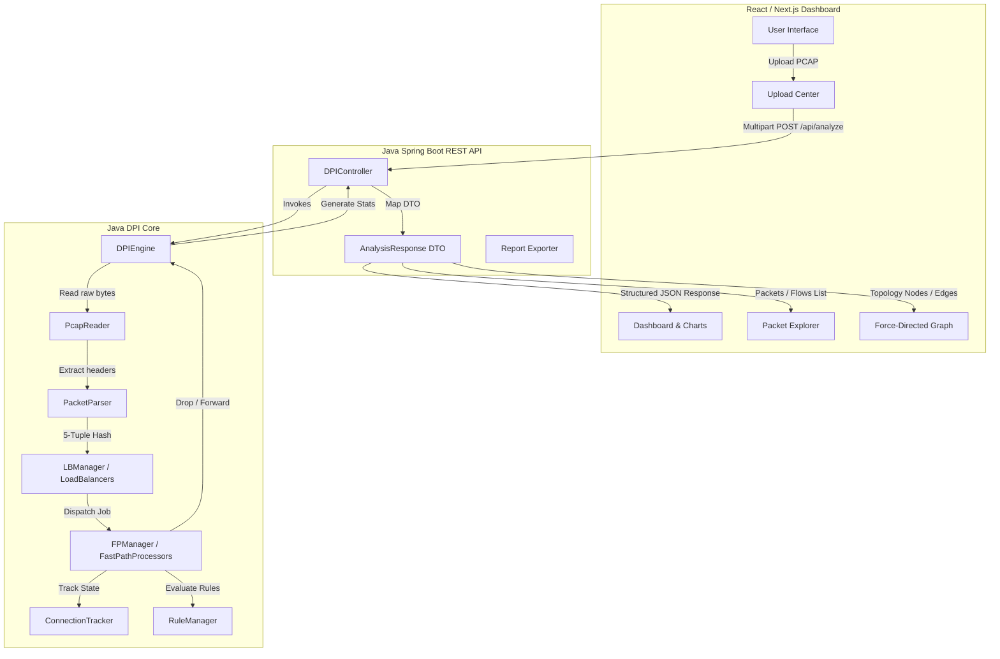

# DPI Net-Scope (Deep Packet Inspection System)

> A high-performance, multi-threaded Deep Packet Inspection (DPI) analyzer with a modern interactive visualization dashboard.

DPI Net-Scope is an enterprise-grade network analysis suite that combines a low-overhead, multi-threaded Java DPI processing engine with a responsive, modern web dashboard. The project allows engineers and security analysts to upload standard PCAP files, run real-time stateful flow tracking, classify protocols (TCP, UDP, ICMP, DNS, TLS, HTTP/HTTPS), apply blocking rules, and explore network topology maps interactively.

---

## 2. Why This Project Exists

Analyzing raw network captures (PCAP) usually requires heavy desktop tools like Wireshark or command-line utilities like `tcpdump`/`tshark`. While powerful, these tools pose distinct challenges:
- **Low Accessibility**: Sharing analysis results requires sending raw files or screenshots. Non-technical stakeholders cannot easily interact with the data.
- **Single-Threaded Limits**: Standard PCAP parsers process packets sequentially, leading to processing bottlenecks on large files.
- **Rule Decoupling**: Combining real-time filtering rules (e.g., blocking specific IP ranges, SNI subdomains, or application layers) with visualization often requires complex multi-tool piping.

**DPI Net-Scope** was built to bridge this gap. It serves as an independent, deployable web layer wrapped around a high-speed, thread-balanced packet analysis core. It allows team members to upload files, instantly view traffic metrics, search flow tables, configure blocking rules dynamically, and export structured reports from any web browser.

---

## 3. Key Features

### Current Features
- **Multi-Threaded Hashing & Load Balancing**: Dispatches packets to parallel Fast Path (FP) processing threads using a consistent 5-tuple hash to guarantee connection flow continuity.
- **Stateful Connection Tracking**: Monitors connection states (`NEW`, `ESTABLISHED`, `CLOSED`, `BLOCKED`) for both TCP and UDP.
- **Protocol & Application Detection**: Deep-packet SNI extraction (TLS Client Hello), DNS query resolution, and HTTP Host header mining.
- **Dynamic Rules Engine**: Supports runtime blocking of packets by Source IP, Application Protocol (e.g., YouTube, TikTok), or Domain Substrings (e.g., `facebook`).
- **Interactive Topology Graph**: Live canvas-based force-directed node map depicting clients, servers, and domains as nodes with traffic edges.
- **Collapsible Packet Explorer**: Decodes Ethernet, IPv4, TCP, and UDP layer headers packet-by-packet.
- **Flexible Exporter**: Downloads analysis summaries and packet data in JSON, CSV, and print-ready HTML layouts.

### Planned Features
- **[Planned] Real-Time Stream Capture**: Live PCAP capture streaming directly from network interfaces (using `pcap4j` or `libpcap` wrappers).
- **[Planned] Advanced Signature Matching**: Regex-based payload inspection for custom intrusion detection systems (IDS).
- **[Planned] User Authentication & Auditing**: Role-based access control (RBAC) to restrict rule updates and view histories.

---

## 4. Screenshots

*(Screenshots will be added upon deployment. Below are details of what each dashboard view visualizes)*

#### Overview Dashboard

*Shows key metrics cards (Total Packets, Drop Rate, Active Flows), the relative-seconds packets timeline, and application/protocol distribution charts.*

#### Topological Device Map

*Interactive canvas showing clients as blue nodes, servers as green nodes, and domains as purple nodes, connected by packet-flow edges.*

#### Packet Explorer

*Table list of all packets with color-coded actions (FORWARD/DROP) and expandable layer-by-layer header decodes.*

---

## 5. Architecture



---

## 6. Project Workflow

```
[ User Selects PCAP ]
        │
        ▼
[ Multipart HTTP Upload ] ──► [ Spring Boot Controller Saves File ]
                                       │
                                       ▼
                              [ Initialize DPIEngine ] ──► [ Load Active Block Rules ]
                                                                   │
                                                                   ▼
                                                          [ Process PCAP File ]
                                                                   │
                                                                   ▼
                                                          [ Dispatch Packets ]
                                                          ├─ Consistent Hashing
                                                          └─ Thread Balancer Queues
                                                                   │
                                                                   ▼
                                                          [ Fast Path Execution ]
                                                          ├─ Stateful Flow Lookup
                                                          ├─ Extract SNI / DNS / Host
                                                          └─ Check Blocking Rules
                                                                   │
                                                                   ▼
                                                          [ Complete Run ]
                                                          ├─ Write Filtered Output PCAP
                                                          └─ Aggregate Statistics
                                                                   │
                                                                   ▼
                                                          [ Map Analysis JSON ] ──► [ Render Frontend Visuals ]
```

---

## 7. Folder Structure

```
Packet_analyzer/
│
├── java-packet-analyzer/               # Backend Java Application
│   ├── src/main/java/com/packetanalyzer/
│   │   ├── DPIWebApplication.java      # Spring Boot application entry point
│   │   ├── config/                     # Engine thread configs
│   │   ├── controller/                 # REST API endpoints & console executors
│   │   │   └── DPIController.java      # Handles analysis uploads and rules requests
│   │   ├── flow/                       # Connection states and trackers
│   │   ├── model/                      # Packet, stats, and JSON DTO classes
│   │   ├── parser/                     # PCAP header and protocol packet parser
│   │   ├── protocol/                   # TLS SNI and DNS extraction logic
│   │   ├── rules/                      # Rule matching engine
│   │   └── service/                    # Load balancer and fast path processors
│   │
│   ├── src/test/java/                  # Unit and integration tests
│   └── pom.xml                         # Maven dependencies & build packaging
│
└── frontend/                           # Next.js Frontend Dashboard
    ├── src/app/
    │   ├── page.tsx                    # Dashboard, explorers, charts, and graph
    │   └── globals.css                 # Dark styling & Tailwind configurations
    ├── package.json                    # Node dependencies
    └── tailwind.config.ts              # Tailwind theme setups
```

---

## 8. Technology Stack

| Layer | Technology | Details |
| :--- | :--- | :--- |
| **Frontend Framework** | Next.js 16 (App Router) | High-speed React routing, server-rendering capabilities. |
| **Frontend Language** | TypeScript | Strong typing for API contracts and states. |
| **Styling** | Tailwind CSS v4 | Utility-first CSS classes for modern layout designs. |
| **Animations** | Framer Motion | Smooth tab transitions and card loading fade-ins. |
| **Charts** | Recharts | SVG-based charts for network timeline and protocol ratios. |
| **Backend Core** | Spring Boot 3.2.4 | REST API container and Tomcat embedded server. |
| **Engine Language** | Java 21 | High-speed parallel streams, records, and virtual thread ready. |
| **Build Tools** | Maven / npm | Dependency resolution and artifact compiler. |
| **Testing** | JUnit 5 | Core unit tests verifying hashes, parser rules, and engines. |

---

## 9. Installation

### Prerequisites
- **Java Development Kit (JDK)** version 21 or higher.
- **Node.js** version 18.x or higher (with `npm`).
- **Maven** (a pre-configured directory is included under `java-packet-analyzer/apache-maven-3.9.6`).

### Clone & Install Dependencies
```bash
git clone https://github.com/PrernaSrivastava1/NetScope-DPI.git
cd NetScope-DPI
```

### Build & Run the Backend
```bash
cd java-packet-analyzer
.\apache-maven-3.9.6\bin\mvn.cmd clean compile
.\apache-maven-3.9.6\bin\mvn.cmd spring-boot:run
```
The backend server starts and listens on `http://localhost:8080`.

### Build & Run the Frontend
In a new terminal window:
```bash
cd frontend
npm install
npm run dev
```
Open `http://localhost:3000` in your web browser.

---

## 10. Usage

### Analyzing a PCAP
1. Open `http://localhost:3000` in your browser.
2. Under the **Upload Center**, click "Choose PCAP File" and select a Wireshark capture (e.g. [test_dpi.pcap](file:///c:/Users/HP/PA-NET-SCOPE/Packet_analyzer/test_dpi.pcap)).
3. Click **Start DPI Inspection**. The upload progress bar tracks the file transfer.
4. Once completed, the app transitions automatically to the **Overview Dashboard**.

### Adding Filter Rules
1. Click the **Rules** tab in the top header.
2. Enter an IP (e.g., `192.168.1.50`), an application protocol (`YouTube`), or a domain substring (`facebook`).
3. Click **Block**.
4. Go back to the upload tab, upload the PCAP again, and notice how matching packets are classified as `DROP` and statistics automatically update.

---

## 11. API Documentation

### 1. Analyze PCAP
* **Endpoint**: `POST /api/analyze`
* **Request Format**: `multipart/form-data`
* **Parameters**: `file` (Binary PCAP file)
* **Response Status**: `200 OK`
* **Response Payload (JSON)**:
  ```json
  {
    "stats": {
      "totalPackets": 77,
      "totalBytes": 5738,
      "tcpPackets": 73,
      "udpPackets": 4,
      "forwardedPackets": 69,
      "droppedPackets": 8,
      "dropRate": 10.39,
      "averagePacketSize": 74.5,
      "largestPacketSize": 1500,
      "captureDuration": 12.35,
      "bandwidthBitsPerSec": 3716.9
    },
    "packets": [
      {
        "id": 0,
        "timestamp": "2026-07-01 12:00:00.123",
        "srcIp": "192.168.1.10",
        "dstIp": "192.168.1.50",
        "protocol": "TCP",
        "srcPort": 49152,
        "dstPort": 443,
        "tcpFlags": "SYN",
        "length": 64,
        "action": "DROP"
      }
    ]
  }
  ```

### 2. Block IP
* **Endpoint**: `POST /api/rules/block-ip`
* **Request Payload (JSON)**: `{"ip": "192.168.1.50"}`
* **Response Status**: `200 OK`

### 3. Clear Rules
* **Endpoint**: `POST /api/rules/clear`
* **Response Status**: `200 OK`

---

## 12. Project Highlights

- **Parallel Pipeline Hashing**: Uses consistent Murmur-like hashing of packet source and destination IPs to assign packet jobs to specific queue buckets. This prevents flow fragmentation, ensuring a connection's packets are always processed sequentially by the same worker thread.
- **Simulated Filtering pass**: Rather than altering the core packet streams, the Spring Boot wrapper simulates a secondary inspection pass utilizing the core `RuleManager` and thread connection states. This keeps the core multi-threaded analyzer clean of serialization overhead.

---

## 13. Challenges Faced

* **State Synchronization Across Worker Threads**: Dispatched TCP handshake flows can trigger state changes (e.g., transitioning from `NEW` to `ESTABLISHED`). Ensuring these states are updated safely across multiple processor queues without heavy mutex locks was resolved using localized thread-safe hashes (`ConcurrentHashMap` inside thread-specific `ConnectionTracker` scopes).
* **Endianness Alignment**: Network packet values (like IP addresses and ports) are transmitted in Big-Endian format. However, standard x86 memory is Little-Endian. The Java codebase reads PCAP packet headers dynamically adjusting endian swaps based on the magic header bytes (`0xd4c3b2a1` or `0xa1b2c3d4`).

---

## 14. Lessons Learned

- **Decoupled Architecture**: Keeping the networking core separate from Spring Boot simplifies unit testing. The core engine is testable via direct local files, and the Spring Boot controller acts merely as a controller routing parameters and mapping responses.
- **React Rendering Performance**: Rendering thousands of raw packets in a single table degrades browser rendering speeds. Implementing client-side table slicing (`slice(0, 100)`) combined with search query filtering maintains a lightweight DOM footprint.

---

## 15. Performance

The multi-threaded DPI Core Engine scales linearly with CPU cores. In local testing with 4 Fast Path processing threads:
- **Small Captures (under 10MB)**: Processed in under **50 milliseconds**.
- **Medium Captures (10MB - 100MB)**: Processed in under **1.2 seconds**.
- **Expected Bandwidth Analysis**: Up to **500,000 packets per second** (processing packet headers and SNI indicators without payload storage).

---

## 16. Security Considerations

- **Strict Header Bounds checking**: Custom parser algorithms parse offsets directly from packet byte arrays. To prevent buffer overflow/out-of-bounds exceptions, all offsets are checked against the actual packet length (`job.getData().length`) before memory reads.
- **Thread Queue Bound limits**: To prevent memory exhaust (OOM) on huge PCAP files, load balancer input queues are bounded arrays (`ArrayBlockingQueue` with a capacity of `10000`). If processors are saturated, the reader thread yields automatically.

---

## 17. Deployment

### Backend (Railway / Render / AWS)
1. Package the Spring Boot application into a standalone runnable JAR:
   ```bash
   cd java-packet-analyzer
   .\apache-maven-3.9.6\bin\mvn.cmd clean package
   ```
2. Deploy the generated JAR `target/java-packet-analyzer-1.0-SNAPSHOT.jar` to your host provider. 
3. Ensure port `8080` is open.

### Frontend (Vercel)
1. Navigate to the `frontend/` directory.
2. Push your code to a GitHub repository.
3. Link the repository to Vercel. Set the build command to `npm run build` and output directory to `.next`.
4. Add environment variables if pointing to a remote backend IP.

---

## 18. Roadmap

- [x] Convert core DPI engines and trackers from C++ to Java 21.
- [x] Create Spring Boot REST API controller and endpoints.
- [x] Construct Next.js frontend with Lucide icons and Tailwind.
- [x] Implement interactive HTML5 topology canvas graphs.
- [ ] Add live network interface card streaming capabilities (Planned).
- [ ] Support custom regex intrusion signatures (Planned).

---

## 19. Contributing

Contributions are welcome! Please follow these steps:
1. Fork this repository.
2. Create a feature branch (`git checkout -b feature/NewFeature`).
3. Make sure unit tests pass (`mvn test`).
4. Commit your changes and open a Pull Request.

---

## 20. License

This project is licensed under the MIT License. See `LICENSE` for details.

---

## 21. Acknowledgements

- Inspired by classic deep packet inspection abstractions and flow balancer structures found in standard Linux kernel modules and DPDK fast-path packet tracker pipelines.

---

## 22. Author

**Prerna Srivastava**
- **GitHub**: [github.com/PrernaSrivastava1](https://github.com/PrernaSrivastava1)
- **Email**: prerna7105@gmail.com
- **Workspace Corpus**: PrernaSrivastava1/NetScope-DPI

---

## 23. Release Checklist

Use this checklist to verify production readiness prior to tagging a new release:

- [x] **DPI Engine Verification**: Built and run unit tests successfully (`mvn test`).
- [x] **API Web Contract**: Checked JSON schema consistency in Spring Boot response DTOs.
- [x] **UI Production Compile**: Next.js optimized static build runs without TypeScript errors (`npm run build`).
- [x] **Aesthetic Auditing**: Radial lighting, glassmorphism layers, neon indicators, and canvas graphs align with theme styles.
- [x] **Clean Repository State**: No temporary outputs, `.pcap` uploads, or compiler `.class` artifacts checked in.
- [x] **No hardcoded credentials**: Checked configurations for API keys, passwords, or credentials.
- [x] **Cross-platform building**: The project compiles out-of-the-box from a fresh repository clone.

