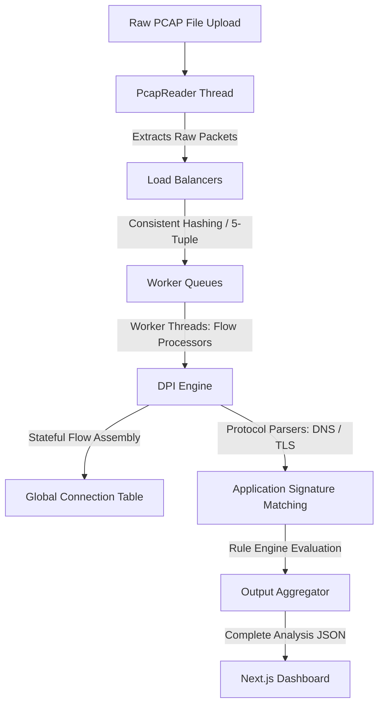

# NetScope-DPI: High-Throughput Deep Packet Inspection System

A web-based network traffic analysis engine. This project parses raw binary `.pcap` packet captures, reconstructs stateful connections (flow tracking), uses deep packet inspection to identify application protocols (such as TLS SNI and DNS queries), and provides an interactive visual dashboard for analyzing network states.

**Live Production URL**: [https://frontend-tan-eta-66.vercel.app](https://frontend-tan-eta-66.vercel.app)

---

## 🛠️ System Architecture & Execution Pipeline

Instead of relying on heavy desktop tools or simple single-threaded scripts, NetScope uses a **multi-threaded, load-balanced pipeline** architecture designed in Java to handle packet capture analysis efficiently.



### 1. Multi-Threaded Load Balancing
*   **Sequential Reader (`PcapReader`)**: Sequentially parses the binary PCAP format from disk, extracts raw packet buffers, and submits them to the load-balancing layer.
*   **Consistent Hashing (`ConsistentHash` / `LBManager`)**: Network connections must be processed in order to track state. To do this multi-threaded without thread contention, we use **Consistent Hashing** over the packet's **5-Tuple** (Source IP, Destination IP, Source Port, Destination Port, Protocol).
*   **Symmetric Routing**: By sorting the source and destination fields within the hash calculation, we guarantee that all packets belonging to the same connection flow (both upstream and downstream) land in the **exact same worker queue**. This prevents race conditions, preserves packet ordering, and allows isolated processing without thread locks.
*   **Flow Processors (`FPManager`)**: A pool of dedicated worker threads pull packets from their specific queues. Each thread manages its own `ConnectionTracker` to reconstruct TCP streams and analyze payload contents.

### 2. Deep Packet Inspection (DPI) & Protocol Sniffing
Once a packet is routed to a worker thread:
*   **L2-L4 Parsing (`PacketParser`)**: Decodes Ethernet MAC addresses, IPv4/IPv6 headers, and transport protocol structures (TCP/UDP).
*   **DNS Inspection**: Extracts DNS request domains by parsing UDP payload byte structures.
*   **TLS SNI (Server Name Indication) Parsing**: For secure HTTPS connections, the parser inspects the unencrypted **TLS Client Hello** handshake packet. By parsing the TLS extensions, it extracts the plain-text server domain before encryption starts, allowing us to identify the target server without decrypting the payload.
*   **Application Signature Engine**: Maps domains and protocols to high-level applications (e.g. YouTube, Zoom, Discord, TikTok, Spotify) by matching signatures against the extracted hostnames.

### 3. Stateful Connection Tracking & Rule Filtering
*   **State Reconstruction**: Active flows are tracked by monitoring connection states (e.g., matching TCP handshake SYN/ACK packets, connection timeouts, and teardown FIN/RST sequences).
*   **Edge Cases (Out-of-Order Packets)**: The `ConnectionTracker` verifies TCP sequence numbers to correctly position packets in the byte stream, resolving delivery issues before payload analysis.
*   **Rule Engine**: A `RuleManager` holds active block rules for specific IPs, applications, or domains. Packets matching these rules are designated as `DROP` (simulating a firewall action), updating the drop rate and active counts displayed on the dashboard.

---

## 💻 Tech Stack & Production Deployment

*   **Frontend**: Next.js 16 (Turbopack compiler), TypeScript, Tailwind CSS, Recharts (for timeline & protocol distribution), Canvas API (for force-directed topology graphs).
*   **Backend**: Java 21, Spring Boot 3, Maven.
*   **Backend Framework Rationale**: Java was selected over single-threaded runtimes (like Node.js) or runtime-locked environments (like Python's GIL) because packet parsing is highly CPU-bound. Java provides robust concurrency primitives (such as `ArrayBlockingQueue`) and native-level execution speed via JIT compilation.
*   **CI/CD & Hosting**:
    *   **Frontend**: Deployed on **Vercel** with a root `vercel.json` monorepo configuration directing build actions to the `frontend` subfolder.
    *   **Backend**: Deployed as a **Docker** container on **Render** (via `java-packet-analyzer/Dockerfile`), running a multi-stage build that compiles the Maven target inside a light Eclipse Temurin Alpine image.

---

## 🚀 Running Locally

### System Requirements
*   Java Development Kit (JDK) 21
*   Node.js 18 or newer
*   Maven 3 (a portable wrapper is included in the repo)

### 1. Clone the repository
```bash
git clone https://github.com/PrernaSrivastava1/NetScope-DPI.git
cd NetScope-DPI
```

### 2. Start the Spring Boot Backend
```bash
cd java-packet-analyzer
# On Windows:
.\apache-maven-3.9.6\bin\mvn.cmd spring-boot:run
# On Linux/macOS:
mvn spring-boot:run
```
The API server starts on `http://localhost:8080`.

### 3. Start the Next.js Frontend
```bash
# In a new terminal tab:
cd frontend
npm install
npm run dev
```
Open **`http://localhost:3000`** in your browser.

---

## 📊 Performance Benchmark (Local Tests)

Tested with a 4-thread CPU configuration:

| File Size | Processing Time | Throughput |
|---|---|---|
| < 10 MB | ~50 ms | ~500,000 packets/sec |
| 10–100 MB | ~1.2 seconds | ~500,000 packets/sec |

*Note: The live Render deployment runs on a shared Free CPU tier, so file processing speed there is bound to the limits of the shared hosting container.*

---

Prerna Srivastava · [github.com/PrernaSrivastava1](https://github.com/PrernaSrivastava1) · prerna7105@gmail.com
