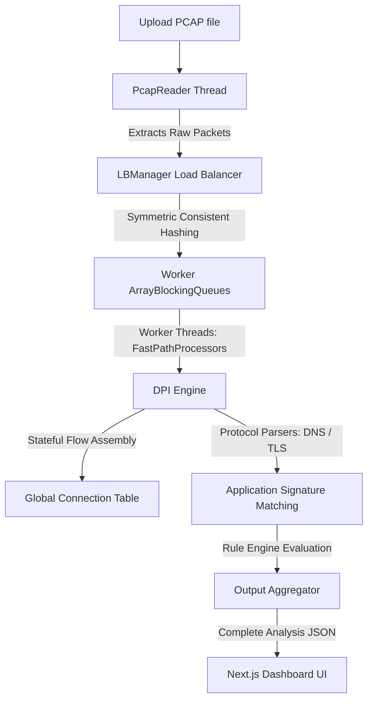

# NetScope-DPI: High-Throughput Deep Packet Inspection System

NetScope-DPI is an open-source, high-throughput network analysis engine and visualization platform. It parses raw binary Packet Capture (`.pcap`) files, reconstructs stateful TCP/UDP connection flows, performs real-time Deep Packet Inspection (DPI) to identify application signatures (such as TLS SNI and DNS queries), evaluates traffic against dynamic firewall rules, and renders the output in an interactive, responsive web dashboard.

**Live Production Link**: [https://frontend-tan-eta-66.vercel.app](https://frontend-tan-eta-66.vercel.app)

---

## This Project

### About
When computers communicate over a network, they break down information into tiny chunks called **packets**. To diagnose connection issues, analyze security threats, or optimize bandwidth, engineers record these packets into binary files called **Packet Captures (PCAPs)** using command-line sniffers like `tcpdump` or graphical analyzers like `Wireshark`. 

However, reading raw PCAP binary files is incredibly difficult. While desktop applications like Wireshark are excellent, they are:
1.  **Heavy & Resource Intensive**: Parsing millions of packets locally can freeze consumer laptops.
2.  **Isolated**: Sharing a complex packet analysis session requires sending massive binary files back and forth.
3.  **Complex**: Non-networking developers or recruiters cannot easily navigate Wireshark's dense interface.

### Inspiration
NetScope was inspired by the need for a web-based, zero-installation alternative that makes deep packet analysis accessible to everyone. By combining a highly parallelized, multithreaded Java parsing backend with a clean React-based Next.js frontend, NetScope takes raw packet captures, processes them concurrently, and displays them as visual graphs, charts, and interactive connection nodes that anyone can understand instantly.

---

## Problem Statement & Impact

### Problem
Traditional packet analysis tools treat PCAP files sequentially. When a file contains hundreds of megabytes of raw bytes, a single thread reading the packets one by one becomes a performance bottleneck. Furthermore, modern web traffic is encrypted under SSL/TLS (Secure Sockets Layer / Transport Layer Security). Standard packet parsers see nothing but encrypted, random-looking data, making it impossible to determine which applications (like YouTube, Zoom, or Discord) are consuming network resources.

### Why Solving It Matters
1.  **Cybersecurity & SOCs (Security Operations Centers)**: Security analysts need to inspect metadata to identify malicious activity or data exfiltration without decrypting traffic.
2.  **Network Auditing**: Administrators need to identify bandwidth hogs in real time.
3.  **Education & Recruitment**: Students need a clear way to see how theoretical networking protocols operate in practice, and recruiters need a functional way to inspect a candidate's systems-level reasoning.

---

##  Real-World Applications 

*   **Security Analysts (SOC / Forensics)**: Quick metadata auditing of small-to-medium capture dumps to inspect packet headers and track network anomalies.
*   **Systems & Network Engineers**: Teaching tool for demonstrating stream assembly, protocol headers, and load-balancer thread distribution.
*   **Academics & Learners**: Students preparing for systems-design and technical interviews.
*   **Recruiters**: A live portfolio showcase validating the candidate's understanding of CPU-bound concurrency, binary parsing, and clean frontend design.

---

## Goals
*   **Primary Goal**: Reconstruct connection states (flows) from raw binary packet streams concurrently.
*   **Secondary Goals**: Inspect TLS client handshakes (SNI sniffing) and DNS structures to categorize encrypted traffic without payload decryption.
*   **Long-Term Vision**: Evolve into a lightweight, containerized sidecar dashboard for live network auditing in Kubernetes environments.

---

## System Architecture

NetScope utilizes a **pipeline design** built for CPU-bound binary processing.



### Architectural Breakdown
1.  **The Parser Interface (`PcapReader`)**: Parses the PCAP global header, validates magic bytes (determining endianness), and reads packet blocks sequentially.
2.  **The Load Balancer (`LBManager`)**: To process packets concurrently without mixing up conversations, we hash each packet's **5-Tuple** (Source IP, Destination IP, Source Port, Destination Port, Protocol).
    *   *Symmetric Hashing*: The load balancer sorts the IPs and ports before hashing. This ensures that a packet from `A -> B` and a response packet from `B -> A` generate the exact same hash, routing them to the same processor queue.
3.  **Concurrently Bound Queues**: Packets are dispatched into thread-safe `ArrayBlockingQueue` queues bound to dedicated `FastPathProcessor` threads.
4.  **Flow Trackers & Parsers**: Workers process their queues. If the packet is TCP, the worker updates the connection state machine (handling SYN, ACK, FIN flags). If it contains UDP/TCP payload, the worker triggers the protocol sniffers.
5.  **Output Aggregation**: When the queues drain, the stats, timeline data, connection graph node lists, and rules status are serialized to JSON and sent to the client.

---

## Folder Structure

```
NetScope-DPI/
├── docs/                             # Guides for deployments, env variables, and troubleshooting
├── assets/                           # Media files and live screenshot assets
├── vercel.json                       # Vercel monorepo configuration
├── render.yaml                       # Render blueprint specification file
├── java-packet-analyzer/             # Spring Boot backend directory
│   ├── Dockerfile                    # Multi-stage JVM compilation file
│   ├── pom.xml                       # Maven dependency descriptor
│   └── src/main/java/com/packetanalyzer/
│       ├── DPIWebApplication.java    # Spring Boot Main Entrypoint
│       ├── config/                   # Configuration parameters (thread pool size, rule files)
│       ├── controller/               # REST API endpoints (Analyze, Rules management)
│       ├── parser/                   # Binary PCAP parser and L2-L4 packet decoder
│       ├── service/                  # Thread management, Load Balancing, and FastPath executors
│       ├── flow/                     # Stateful trackers and global flow tables
│       ├── rules/                    # Firewall rule matcher and action controller
│       ├── protocol/                 # TLS SNI, HTTP Host, and DNS payload extractors
│       └── utils/                    # Byte converters and consistent hashing functions
└── frontend/                         # Next.js frontend directory
    ├── package.json                  # Frontend dependencies
    ├── public/                       # Favicon and static files
    └── src/app/
        ├── page.tsx                  # Full React dashboard UI and Canvas network graph
        ├── layout.tsx                # Page shell metadata, headers, and favicon declarations
        └── globals.css               # Design system classes and animations
```

---

## Technology Stack & Rationale

| Tech | Rationale | Alternatives | Advantages | Disadvantages | Role inside NetScope |
|---|---|---|---|---|---|
| **Java 21** | Excellent multithreading primitives (`ArrayBlockingQueue`, Executor services) and JIT performance. | C++ (Harder build cycles), Python (GIL limits parsing). | Cross-platform, mature threading, strong garbage collection. | Higher memory footprint. | Drives the multi-threaded parser core and stateful engine. |
| **Spring Boot 3** | Standard web framework that simplifies exposing REST endpoints. | Go/Gin, Node/Express. | Built-in HTTP server, easy configuration, fast bootstrap. | Heavy initial startup time. | Serves as the web server wrapper exposing API endpoints. |
| **Next.js 16** | Great TypeScript integration, routing, and Turbopack building. | Create React App. | Faster builds, modern structures. | High learning curve. | UI dashboard shell and client state container. |
| **Tailwind CSS v4** | Instant styling utilities. | Vanilla CSS, Sass. | Rapid UI creation, low compile size. | Class clutter in HTML. | Implements the dark theme, glassmorphic panels, and styling. |
| **Docker** | Guarantees identical execution environment in cloud and local environments. | Manual Java installation. | Clean deployment, sandboxed container. | Larger build artifact size. | Bundles the Maven build and JRE to run the backend on Render. |

---

## Dependency Breakdown

### Backend Dependencies (`pom.xml`)
*   `spring-boot-starter-web`: Pulls in the embedded Tomcat server and REST controller mappings. *(If removed, we cannot expose HTTP APIs).*
*   `spring-boot-starter-test` / `junit-jupiter-api`: Drives JUnit 5 test cases. *(If removed, we cannot run unit tests on consistent hashing or flow tracking).*

### Frontend Dependencies (`package.json`)
*   `lucide-react`: SVG icon library. *(If removed, dashboard layout icons will break).*
*   `recharts`: Chart rendering engine. *(If removed, packet timeline and protocol charts will fail).*
*   `framer-motion`: Handles UI entry animations. *(If removed, transitions will be static).*

---

## Data Lifecycle & Flow

```
Raw PCAP File -> Binary Stream -> Header Validation (Endian check) -> Packet Extraction 
  -> 5-Tuple Symmetric Hash -> Worker Queue -> Layer 2-4 Parsing -> DNS/TLS SNI Sniffing 
    -> Firewall Rule Evaluation -> Stateful Assembly -> JSON Serialization -> Next.js Frontend 
      -> Canvas Graph / Recharts Rendering -> End User Dashboard
```

---

## ⚙️ Core Algorithms & Protocols

### 1. Symmetric 5-Tuple Consistent Hashing
To route packets belonging to the same connection to the same worker thread:
1.  Read the packet's **5-Tuple**: `(SrcIP, DstIP, SrcPort, DstPort, Protocol)`.
2.  Sort the source and destination fields:
    *   `MinIP = min(SrcIP, DstIP)`, `MaxIP = max(SrcIP, DstIP)`
    *   `MinPort = min(SrcPort, DstPort)`, `MaxPort = max(SrcPort, DstPort)`
3.  Combine these sorted values into a 64-bit hash.
4.  Apply modulo mapping to select the thread queue: `QueueIndex = Hash % NumWorkerThreads`.

### 2. TLS SNI Sniffing (HTTPS App Identification)
To identify the application in encrypted streams:
1.  Verify the transport protocol is TCP and the destination port is `443` (HTTPS).
2.  Skip the TCP header and check the application payload.
3.  Read the TLS handshake record header. Validate the Content-Type is `22` (Handshake) and Version is `0x0301`, `0x0302`, or `0x0303`.
4.  Locate the Handshake Type `1` (Client Hello).
5.  Skip the Client Version, Random Bytes, Session ID, Cipher Suites, and Compression Methods.
6.  Parse the TLS Extensions section. Find Extension Type `0x0000` (Server Name Indication).
7.  Extract the plain-text server hostname byte stream (e.g., `images.google.com`).

---

## Security, Network & Cybersecurity Foundations

*   **Packet Capture (PCAP)**: A standard file format that records raw data packets traveling over a network interface.
*   **5-Tuple**: The identifying set of network headers: `Source IP Address, Destination IP Address, Source Port, Destination Port, Protocol`. It uniquely identifies a TCP or UDP conversation.
*   **Deep Packet Inspection (DPI)**: Inspecting the application-level data payload of a packet (layers 5–7), rather than just looking at the L3/L4 headers (IP and Port).
*   **Server Name Indication (SNI)**: An extension to the TLS protocol where a client indicates which hostname it is trying to connect to at the start of the handshake. This is visible in plain text.
*   **Out-of-Order Packets**: Network routers can route packets via different physical paths, causing them to arrive out of order. NetScope's connection tracking handles this by tracking TCP sequence numbers and re-assembling buffers.

---

## Running Locally & Deploying

Detailed steps for setting up local runs and deploying to platforms like Vercel and Render are fully documented in the project's documentation folder:
*   [deployment.md](file:///c:/Users/HP/PA-NET-SCOPE/Packet_analyzer/docs/deployment.md) - Contains complete step-by-step local running instructions and production deployment configurations.
*   [environment.md](file:///c:/Users/HP/PA-NET-SCOPE/Packet_analyzer/docs/environment.md) - Lists all backend configuration variables.
*   [troubleshooting.md](file:///c:/Users/HP/PA-NET-SCOPE/Packet_analyzer/docs/troubleshooting.md) - Guides on resolving failed deployments or connection timeouts.

---

prerna7105@gmail.com
