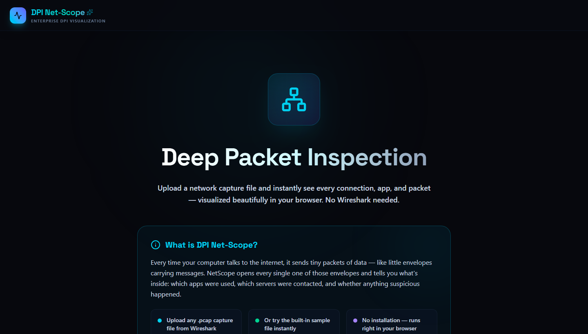

# NetScope-DPI

A web-based network traffic analyzer. Upload a `.pcap` file and get an interactive dashboard showing every packet, connection, and app — without touching the command line.

**Live demo**: https://frontend-tan-eta-66.vercel.app



---

## The problem

If you capture network traffic on your machine (using Wireshark or tcpdump), you end up with a `.pcap` file full of raw binary data. Reading it is painful. Wireshark helps but it's a heavy desktop app, it doesn't run in a browser, and you can't easily share your analysis with someone else.

I wanted something simpler — paste in a capture file, get a clean visual breakdown, and be able to hand someone a link to explore it themselves.

---

## What it does

- Parses the PCAP file and reads every single packet inside it
- Identifies protocols: TCP, UDP, DNS, TLS, HTTP
- Figures out which app each connection belongs to — YouTube, TikTok, Discord, Zoom, Spotify, etc. (by reading TLS handshake data and DNS queries inside the packets)
- Shows a timeline of when traffic spiked
- Draws a node map of which devices talked to which servers
- Lets you set block rules (by IP, app, or domain) and see how the results change
- Exports everything as JSON, CSV, or HTML

---

## How it works

The backend is a Java engine that reads the binary PCAP format, splits packets across multiple CPU threads using consistent hashing (so packets from the same connection always stay on the same thread, keeping the order intact), extracts app and domain info from inside the packets, applies any block rules, and returns a full JSON report.

The frontend is a Next.js dashboard that takes that JSON and renders it as charts, a filterable packet table, and an interactive canvas network graph.

---

## Stack

| | |
|---|---|
| Frontend | Next.js 16, TypeScript, Tailwind CSS v4 |
| Charts | Recharts |
| Animations | Framer Motion |
| Backend | Java 21, Spring Boot 3 |
| Build | Maven, npm |
| Tests | JUnit 5 |
| Hosting | Vercel (frontend), Render (backend) |

---

## Running locally

You need Java 21 and Node.js 18+ installed.

```bash
git clone https://github.com/PrernaSrivastava1/NetScope-DPI.git
cd NetScope-DPI
```

Start the backend:
```bash
cd java-packet-analyzer
.\apache-maven-3.9.6\bin\mvn.cmd spring-boot:run
```

Start the frontend (new terminal):
```bash
cd frontend
npm install
npm run dev
```

Open http://localhost:3000. If you don't have a PCAP file, click **"Load Sample PCAP"** to use the built-in test capture.

---

## API

| Method | Endpoint | Description |
|---|---|---|
| POST | `/api/analyze` | Upload and analyze a PCAP file |
| POST | `/api/analyze/sample` | Run the built-in sample file |
| GET | `/api/rules` | Get active block rules |
| POST | `/api/rules/block-ip` | Block a source IP |
| POST | `/api/rules/block-app` | Block an app (e.g. YouTube) |
| POST | `/api/rules/block-domain` | Block a domain |
| POST | `/api/rules/clear` | Remove all rules |
| GET | `/api/health` | Health check |

---

## Project layout

```
NetScope-DPI/
├── java-packet-analyzer/
│   └── src/main/java/com/packetanalyzer/
│       ├── controller/      REST API endpoints
│       ├── parser/          Reads raw PCAP binary
│       ├── service/         Multi-threaded packet processors
│       ├── flow/            Connection state tracker
│       ├── rules/           Block rule engine
│       └── protocol/        TLS SNI + DNS extraction
│
└── frontend/
    └── src/app/
        ├── page.tsx         Full dashboard UI
        └── globals.css      Theme and styles
```

---

## Performance

Tested locally, 4 processing threads:

| File size | Time |
|---|---|
| Under 10 MB | ~50ms |
| 10–100 MB | ~1.2 seconds |
| Throughput | ~500k packets/second |

---

Prerna Srivastava · [github.com/PrernaSrivastava1](https://github.com/PrernaSrivastava1) · prerna7105@gmail.com
